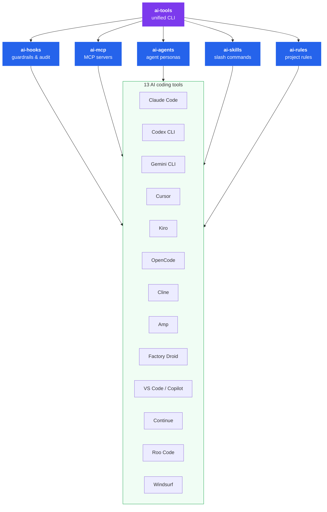

# ai-tools


**Universal configuration and runtime engine for AI coding tools. Define once — works everywhere.**

`ai-tools` is a monorepo of engines that manage hooks, MCP servers, agents, skills, and rules across 13 AI coding tools. Write your configuration once and adapters translate it into the native format each tool expects.

## Why

Every AI coding tool has its own format for hooks, MCP servers, agents, skills, and rules. If you use more than one tool — or your team does — you're maintaining the same configuration in multiple places.

ai-tools lets you define each configuration surface once. Adapters translate it into the native format for every tool you use: Claude Code, Cursor, Copilot, Gemini CLI, and 9 others.

Five engines — one for each configuration surface — plus a unified CLI that orchestrates them all.



## Packages

| Package | CLI | Description |
|---------|-----|-------------|
| [`@premierstudio/ai-tools`](packages/cli) | `ai-tools` | Unified CLI — routes to all engines |
| [`@premierstudio/ai-hooks`](packages/hooks) | `ai-hooks` | Hook engine — guardrails, audit trails, runtime control |
| [`@premierstudio/ai-mcp`](packages/mcp) | `ai-mcp` | MCP server configuration management |
| [`@premierstudio/ai-agents`](packages/agents) | `ai-agents` | Agent persona definitions |
| [`@premierstudio/ai-skills`](packages/skills) | `ai-skills` | Slash commands and prompt templates |
| [`@premierstudio/ai-rules`](packages/rules) | `ai-rules` | Project rules with scoping and priority |

## Supported tools

| Tool | Hooks | MCP | Agents | Skills | Rules |
|------|:-----:|:---:|:------:|:------:|:-----:|
| [Claude Code](https://docs.anthropic.com/en/docs/claude-code) | &check; | &check; | &check; | &check; | &check; |
| [Codex CLI](https://github.com/openai/codex) | | &check; | | &check; | &check; |
| [Gemini CLI](https://github.com/google-gemini/gemini-cli) | &check; | &check; | &check; | &check; | &check; |
| [Cursor](https://cursor.com) | &check; | &check; | &check; | &check; | &check; |
| [Kiro](https://kiro.dev) | &check; | &check; | &check; | &check; | &check; |
| [OpenCode](https://opencode.ai) | &check; | &check; | &check; | &check; | &check; |
| [Cline](https://cline.bot) | &check; | &check; | &check; | &check; | &check; |
| [Amp](https://ampcode.com) | | &check; | | &check; | &check; |
| [Factory Droid](https://factory.ai) | &check; | &check; | &check; | &check; | &check; |
| [VS Code / Copilot](https://code.visualstudio.com) | &ast; | &check; | &check; | &check; | &check; |
| [Continue](https://continue.dev) | | | | &check; | &check; |
| [Roo Code](https://roocode.com) | | &check; | &check; | &check; | &check; |
| [Windsurf](https://windsurf.com) | | &check; | | &check; | &check; |

<sub>&ast; VS Code 1.109+ agent hooks use the Claude Code format — the Claude Code adapter output works directly.</sub>

## Quick start

### Unified CLI

```bash
# Install everything
npm i -D @premierstudio/ai-tools

# Detect installed tools, generate configs, install them
ai-tools detect
ai-tools hooks generate && ai-tools hooks install
ai-tools mcp generate && ai-tools mcp install
ai-tools skills generate && ai-tools skills install
ai-tools agents generate && ai-tools agents install
ai-tools rules generate && ai-tools rules install
```

### Or install individual engines

```bash
# Just hooks
npm i -D @premierstudio/ai-hooks
npx ai-hooks init
npx ai-hooks detect --verbose
npx ai-hooks generate
npx ai-hooks install

# Just MCP servers
npm i -D @premierstudio/ai-mcp
npx ai-mcp init
npx ai-mcp generate
npx ai-mcp install

# Just rules
npm i -D @premierstudio/ai-rules
npx ai-rules init
npx ai-rules generate
npx ai-rules install
```

Each engine follows the same CLI pattern: `init` → `detect` → `generate` → `install`. Use `import` or `sync` to pull existing tool-specific configs back into the universal format.

## Config examples

### Hooks

```ts
// ai-hooks.config.ts
import { defineConfig, hook, builtinHooks } from "@premierstudio/ai-hooks";

export default defineConfig({
  extends: [{ hooks: builtinHooks }],
  hooks: [
    hook("before", ["shell:before"], async (ctx, next) => {
      if (ctx.event.command.includes("npm publish")) {
        ctx.results.push({ blocked: true, reason: "Publishing is restricted" });
        return;
      }
      await next();
    })
      .id("org:block-publish")
      .name("Block npm publish")
      .priority(10)
      .build(),
  ],
  settings: {
    hookTimeout: 5000,
    failMode: "open",
    logLevel: "warn",
  },
});
```

### MCP servers

```ts
// ai-mcp.config.ts
import { defineConfig } from "@premierstudio/ai-mcp";

export default defineConfig({
  servers: [
    {
      name: "filesystem",
      command: "npx",
      args: ["-y", "@modelcontextprotocol/server-filesystem", "./src"],
      transport: "stdio",
    },
  ],
});
```

### Rules

```ts
// ai-rules.config.ts
import { defineRulesConfig } from "@premierstudio/ai-rules";

export default defineRulesConfig({
  rules: [
    {
      name: "typescript-strict",
      content: "Always use strict TypeScript. No `any` types.",
      scope: "always",
      priority: 1,
    },
    {
      name: "test-conventions",
      content: "Co-locate tests as *.test.ts next to source files.",
      scope: "glob",
      globs: ["**/*.test.ts"],
    },
  ],
});
```

## Hooks engine

The hooks engine is the most powerful package — an Express.js-style middleware chain for AI tool actions.

### Universal event model

15 event types across the full AI tool lifecycle:

| Category | Before (blockable) | After (observe-only) |
|----------|-------------------|---------------------|
| Session | `session:start` | `session:end` |
| Prompt | `prompt:submit` | `prompt:response` |
| Tool | `tool:before` | `tool:after` |
| File | `file:read`, `file:write`, `file:edit`, `file:delete` | |
| Shell | `shell:before` | `shell:after` |
| MCP | `mcp:before` | `mcp:after` |
| System | | `notification` |

### Built-in safety hooks

| Hook | Phase | What it does |
|------|-------|-------------|
| `block-dangerous-commands` | before | Blocks `rm -rf /`, `DROP DATABASE`, fork bombs |
| `scan-secrets` | before | Detects API keys, tokens, private keys in file writes |
| `protect-sensitive-files` | before | Prevents writes to `.env`, `credentials.json`, SSH keys |
| `audit-shell` | after | Records command, exit code, duration, tool name |

### Using as a library

Import the engine directly for building platforms that orchestrate AI agents:

```ts
import { HookEngine, builtinHooks } from "@premierstudio/ai-hooks";

const engine = new HookEngine({
  hooks: builtinHooks,
  settings: { failMode: "closed" },
});

const result = await engine.isBlocked(event, { name: "my-platform", version: "1.0" });
if (result.blocked) {
  console.log(`Blocked: ${result.reason}`);
}
```

## Development

```bash
git clone https://github.com/PremierStudio/ai-hooks.git
cd ai-tools
npm install
npm run check   # lint + format + typecheck + test
```

| Command | What it does |
|---------|-------------|
| `npm run check` | Full verification: lint + format + typecheck + test |
| `npm run build` | Build all packages via Turborepo |
| `npm test` | Run all tests (vitest) |
| `npx vitest run packages/hooks` | Test a single package |
| `npm run lint` | oxlint |
| `npm run fmt` | oxfmt (auto-format) |
| `npm run typecheck` | tsc across all packages |

See [CONTRIBUTING.md](CONTRIBUTING.md) for adding adapters and submitting PRs.

## License

MIT
